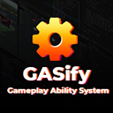
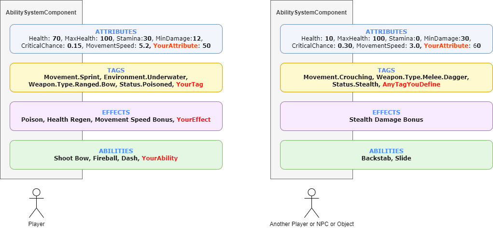
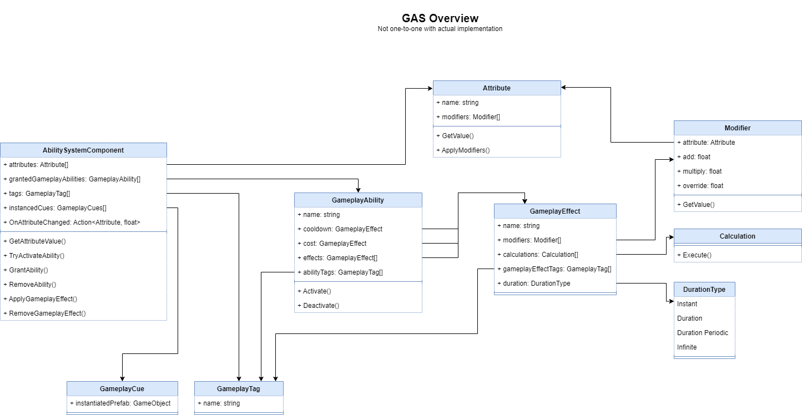

# GASify (FREE) - A Gameplay Ability System for Unity

    
    
 

 

    <b> Full version: https://assetstore.unity.com/packages/slug/255377 </b>
 

## What is it?

A Gameplay Ability System (GAS) is a **framework/toolkit** to create any game mechanic.

A GAS is like a collection of gears to build any kind of ability.
It uses **Attributes**, **Tags**, **Effects** and **Modifiers** to model any imaginable interaction.

You can build MMO/Action RPG abilities, crazy roguelike upgrades/effects, soulslike poise/stamina/dodge/animation synced systems and immersive sim objects and elemental interactions.

GASify is inspired by Unreal's Gameplay Ability System.

<b>FREE VERSION INCLUDES:</b>
- Abilities, Effects, GameplayCues, GameplayTags, Attributes.
- Networking/Multiplayer Integration using Mirror.
- 3 types of Abilities: Instant, Projectile, TargetedProjectile. (Full version: Instant, Projectile, TargetedProjectile, Toggle, Passive, Trigger)
- Input buffering
  
<b>FREE VERSION LIMITATIONS:</b>
- Duration and Infinite GEs have a fixed duration.
- No Calculations (Can't add custom code/attribute formulas to GameplayEffects)
- Only Add/Subtract Attributes Operator (Fullversion: Multiply and Override)
- Only Basic Modifier (constant Value) (Fullversion: Basic, ScalableModifier, AttributeBasedModifier CSVModifier)
- No Tag filters. (Full version: filter ability and effect activation/removal using tags).

## Documentation: https://feliperoddd.gitbook.io/gasify

## Overview:

- **Ability System Component:** Main component to put on any entity. Holds the entity's attributes, abilities that can be used, and Gameplay Effects/Tags currently applied to it.
- **Attributes:** Numeric values e.g. Health, Mana, MaxHealth, MaxMana, MovementSpeed, AttackDamage, CriticalChance, Armor.
- **Modifiers:** Change the value of attributes (Add, Multiply, Override). Modifiers come in 4 flavors: Simple (a constant value), Scalable (Scales it's output by a function e.g. Curve), AttributeBased (Uses another attribute to compute the modifier output)
- **Gameplay Tags:** Can be used to categorize effects/abilities or define states. e.g. Element.Fire, Stats.Buff.Stun or State.Movement.Sprinting
- **Gameplay Effect:** Apply a set of modifiers and Calculations to an AbilitySystemComponent (asc). These effects can have different durations: Instant, Duration, Infinite and Periodic.
- **Calculations:** Adds the capability to create any custom behavior/effect. Needs custom code. Executed with the GameplayEffect that has it attached.
- **Gameplay Ability:** Abilities with cost, cooldown, activation/blockage tags. Included: Instant, Passive, Toggle and many more! Melee and projectile ability example included. Any other custom, non general ability can be created by extending this class.
- **Gameplay Cues:** Play sounds, particle effects, animations by just adding a tag to the effect/ability and the prefab on CueLibrary

## Examples:

- A spell ability that lasts 10s and heals your target every 2s for 20% of your total Mana.
- A passive that increases your CriticalChance by 5% of your MaxHealth but reduces your Armor by 30% your CriticalChance.
- A buff that increases your AttackSpeed by 10% of your missing Health for 5s every time you receive damage.
- A fireball spell that sets objects on fire, causes instant 120% of your MaxDamage as fire damage and 50% your MinDamage as burning damage over 60s.
- A water spell that stops any fire effect and converts any remaining damage over time into healing.
- A projectile ability that disables any Healing effect on a given target, reduces his Armor by 10% of your total Mana, and makes anyone in a 10m radius get poisoned for 50s.
- A mind control spell that allows a player to take control of another character
- You can combine and stack effects, attributes and tags to create any crazy mechanic!
- Abilities can also represent a wide array of ingame actions, and are not limited to powers or spells that players explicitly use. Hit reactions, object interaction, animations, vfx/sfx cues are also easily handled.

## Features:

### Networking/Multiplayer.

    Mirror integration with ability Prediction and Replication!

### Input Buffering

    Buffers any ability that cannot activate immediately and keep retrying to activate it for a brief moment.

### Very performant.

    Nothing runs on Update().
    Handles up to 200k ability activations per second.

### Easy workflow.

    Setup abilities/effects via code or editor.

### Full source code.

    Modify anything to your taste.

## Mirror Integration (Networking/Multiplayer)
The networking integration is available on the free version. 
More info on the docs.

## Intro

## Videos:

1 - GASify - Overview: https://youtu.be/KIY3AKMyYJw  
2 - GASify - Modifiers: https://youtu.be/IXT7QvNHd6M  
3 - GASify - Calculations: https://youtu.be/zESfPcwKg_M  
4 - GASify - Cues: https://youtu.be/GZgtZTv6mN4  
5 - GASify - More Abilities Examples: https://youtu.be/2WOSwancZ1g  
6 - GASify - Editor Workflow: https://youtu.be/3p-tZk3KEiY  
7 - GASify - Bonus Detailed Diagram conversation: https://youtu.be/Wzqz0fnju8o  

